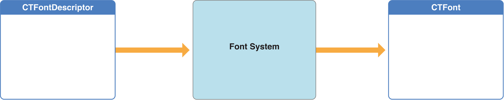

# Core Text 概述

Core Text 是一种用于布局文本和处理字体的高级、底层技术。Core Text 直接与 Core Graphics (CG) 一起工作。Core Graphics 也称为 Quartz，这是一种高速图形渲染引擎，在 OS X 和 iOS 中处理最底层的二维图像。

> 重要提示：Core Text 是为开发更高级别的文本处理框架而设计的。一般应用程序开发人员应该使用 iOS 中的 Text Kit（参见 iOS 文本编程指南）或 OS X 中的 Cocoa 文本系统（参见 Cocoa 文本架构指南）。

Core Text 在高级框架提供的文本布局和字体支持与 Quartz 提供给所有文本和字体框架的低级功能之间进行调和。Quartz 框架作用于字形及其位置。Core Text 知道字符如何映射到字体，并且在调用 Quartz 渲染文本之前，它会考虑有关样式、字体和其他属性的信息。Quartz 是在基础级别绘制字形的唯一方法，而且，因为 Core Text 以 Quartz 可直接使用的形式提供所有数据，所以可以进行高性能文本渲染。

> 多线程：Core Text 函数可以同时从多个线程调用，前提是客户端没有改变任何参数，例如线程之间共享的属性字符串。

## Core Text 是一个基于 C 的、平台中立的 API

iOS 和 OS X 上的 Core Text API 几乎相同，尽管 OS X 版本提供了更丰富的字体管理 API，包括可变字体集合。但是，在平台之间移植代码时，您必须考虑 UIKit 和 AppKit 之间的差异。例如，您必须有一个 Quartz 图形上下文来渲染 Core Text 生成的字形，并且您在每个平台上获得的图形上下文都不同。您在 iOS 中绘制的视图是 iOS 中的 UIView 子类和 OS X 中的 NSView 子类。您应该知道 `CGRect` 对象被传递到 `UIView drawRect:` 方法，而 OS X 版本的 `drawRect:` 被传递 `NSRect` 对象。 （您可以在 OS X 中使用 `NSRectToCGRect` 函数将传入的 `NSRect` 对象转换为作为 Core Text 函数参数所需的 `CGRect` 对象。）

`UIView` 函数 `UIGraphicsGetCurrentContext` 返回的图形上下文是相对于未修改的 Quartz 图形上下文翻转的（即 `UIView` 返回的上下文的原点在左上角），所以 `iOS` 中必须重新翻转图形上下文，但在 OS X 中没有。

Core Text 尽可能使用系统数据类型和服务，并且您使用与 OS X 和 iOS 中的其他核心框架相关的相同约定。例如，Core Text 将 Core Foundation 对象用于许多输入和输出参数，因此您可以将它们存储在 Core Foundation 集合类中。 Core Text 处理的其他对象，例如 CGPath 对象，由 Core Graphics 框架提供。

## Core Text 对象是 C 语言不透明类型

为了速度和简单性，OS X 和 iOS 中的许多低级库都是用纯 C 编写的。使用 Core Text 时，您使用一组 C 函数，例如 `CTFramesetterCreateWithAttributedString` 和 `CTFramesetterCreateFrame`，而不是 Objective-C 类和方法。

### Core Text 不透明类型

Core Text 布局引擎通常使用属性字符串 (`CFAttributedStringRef`) 和图形路径 (`CGPathRef`)。属性字符串对象封装支持显示文本的字符串，并包含定义字符串中字符的风格方面的属性，例如字体和颜色。Core Text 中的排版机制使用属性字符串中的信息来执行字符到字形的转换。

图形路径定义文本框架的形状。在 OS X v10.7 和 iOS 3.2 及更高版本中，路径可以是非矩形的。

CFAttributedString 引用类型 `CFAttributedStringRef` 与其 Foundation 对应物 `NSAttributedString` 是 toll-free bridged 的。这意味着 Core Foundation 类型在函数或方法调用中可以与桥接的 Foundation 对象互换。因此，在看到 `NSAttributedString *` 参数的方法中，可以传入 `CFAttributedStringRef`，在看到 `CFAttributedStringRef` 参数的函数中，可以传入 `NSAttributedString` 实例。 （您可能需要将一种类型转换为另一种类型以抑制编译器警告。）这也适用于 `NSAttributedString` 的具体子类。

属性是定义字符串中字符的样式特征的键值对，它们在共享相同属性的范围内分组。属性本身被传递到属性字符串中，并使用 CFDictionary 对象从中检索。要将样式应用于字形运行（CTRun 对象），请创建一个 CFDictionary 对象来保存要应用的属性，然后创建一个属性字符串，将字典作为参数传递。或者，您可以将属性应用于已经存在的 `CFMutableAttributedString` 对象。尽管 `CFDictionaryRef` 和 `NSDictionary` 是免费桥接的，但存储在字典中的单个属性对象可能不是。

Core Text 对象在运行时形成一个层次结构，如图 1-1 所示。此层次结构的顶部是框架设置器对象 (`CTFramesetterRef`)。使用属性字符串和图形路径作为输入，framesetter 生成一个或多个文本帧 (`CTFrameRef`)。每个 CTFrame 对象代表一个段落。

**图 1-1 Core Text 布局引擎架构**

为了生成 frames，framesetter 调用了一个 typesetter 对象 (`CTTypesetterRef`)。当它在框架中布置文本时， typesetter 会对其应用段落样式，包括对齐、制表位、行距、缩进和换行模式等属性。typesetter 将属性字符串中的字符转换为字形，并将这些字形放入填充文本框架的行中。

每个 CTFrame 对象都包含段落的 line (`CTLine`) 对象。每个 line 对象代表一行文本。 CTFrame 对象可能只包含一个长的 CTLine 对象，也可能包含一组 lines。line 对象是由排版人员在框架设置操作期间创建的，并且与 frame 一样，可以将自己直接绘制到图形上下文中。

每个 CTLine 对象都包含一组 glyph run (`CTRun`) 对象。Glyph run 是一组共享相同属性和方向的连续字形。typesetter 创建 glyph run，因为它从字符串、属性和字体对象生成 line。这意味着一条 line 由一个或多个 glyph run 构成。如果需要，glyph run 可以将自己绘制到图形上下文中，尽管大多数客户端不需要直接与字形运行交互。

### 字体对象

字体在相对于彼此布置字形方面提供帮助，并用于在图形上下文中绘制时建立当前字体。Core Text 字体不透明类型，CTFont，是一个封装了很多信息的特定字体实例。它的引用类型 `CTFontRef` 与 iOS 中的 `UIFont` 和 OS X 中的 `NSFont` 免费桥接。当您创建 CTFont 对象时，您通常会指定（或使用默认）点大小和转换矩阵，从而为字体实例提供特定的属性。然后，您可以查询字体对象以获取有关该特定点大小的字体的多种信息，例如字符到字形映射、编码、字体度量数据和字形数据等。字体度量是诸如 ascent、descent、leading、大写高度、x 高度等参数。字形数据包括边界矩形和 glyph advance 等参数。

Core Text 字体对象是不可变的，因此它们可以被多个操作、工作队列或线程同时使用。有很多方法可以创建字体对象。首选方法是使用 `CTFontCreateWithFontDescriptor` 从字体描述符创建字体对象。您还可以使用许多转换 API，具体取决于您必须从什么开始。例如，您可以使用字体的 PostScript 名称 (`CTFontCreateWithName`) 或 Core Graphics 字体参考 (`CTFontCreateWithGraphicsFont`)。还有 `CTFontCreateUIFontForLanguage`，它为您正在使用的本地化应用程序的用户界面字体创建参考。

Core Text 字体引用提供了一种复杂的、自动的字体替换机制，称为字体级联，它在考虑字体特征的同时选择合适的字体来替换缺失的字体。字体级联基于级联列表，这些列表是有序字体描述符的数组。有一个系统默认级联列表（它是多态的，基于用户的语言设置和当前字体）和一个在字体创建时指定的字体级联列表。使用字体描述符中的信息，级联机制可以根据样式匹配字体以及匹配字符。 `CTFontCreateForString` 函数使用级联列表来选择合适的字体来编码给定的字符串。要指定和检索字体级联列表，请使用 `kCTFontCascadeListAttribute` 属性。

### 字体描述符
由 `CTFontDescriptor` 不透明类型表示的字体描述符提供了一种完全从属性字典中描述字体的机制，以及用于构建新字体的易于使用的字体匹配工具。您可以从字体描述符创建一个字体对象，您可以从一个字体对象获取一个描述符，您可以更改一个描述符并使用它来创建一个新的字体对象。您可以通过创建字体描述符来部分描述字体，例如，仅使用字体系列名称或 weight，然后可以在系统上找到与给定特征匹配的所有字体。`CTFontDescriptorRef` 类型可免费桥接到 iOS 中的 `UIFontDescriptor` 和 OS X 中的 `NSFontDescriptor`。

您可以创建一个字体属性字典，而不是处理复杂的转换矩阵，其中包括 PostScript 名称、字体系列和样式以及特征（例如，粗体或斜体）等属性作为 CTFontDescriptor 对象。您可以使用字体描述符来创建 CTFont 对象。字体描述符可以序列化并存储在文档中，以提供字体的持久性。图 1-2 说明了使用字体描述符创建特定字体实例的字体系统。

**图 1-2 从字体描述符创建字体 **

您可以将字体描述符视为对字体系统的查询。您可以创建具有不完整规范的字体描述符，即在属性字典中具有一个或几个值，系统将从可用的字体中选择最合适的字体。例如，如果您使用具有标准面孔（普通、粗体、斜体、粗斜体）的家族名称的描述符进行查询，则不指定任何特征将匹配家族中的所有面孔，但如果您指定特征字典使用 `kCTFontTraitBold` 的 `kCTFontTraitsAttribute`，结果进一步从整个家族缩小到满足粗体特征的成员。系统可以通过 `CTFontDescriptorCreateMatchingFontDescriptors` 为您提供与您的查询匹配的字体描述符的完整列表。

在 iOS 6.0 及更高版本中，应用程序可以使用 `CTFontDescriptorMatchFontDescriptorsWithProgressHandler` 函数按需下载未安装的可用字体。以这种方式下载的字体不会永久安装，在某些情况下系统可能会删除它们。可供下载的字体在 [iOS 6：字体列表](http://support.apple.com/kb/HT5484) 和 [iOS 7：字体列表](http://support.apple.com/kb/HT5878) 中作为“附加信息”列出。 [DownloadFont](https://developer.apple.com/library/archive/samplecode/DownloadFont/Introduction/Intro.html#//apple_ref/doc/uid/DTS40013404)（在 iOS 开发者库中）演示了下载技术。在 OS X 中不需要按需下载字体，因为所有可用的字体都随系统一起安装。

### 字体集合
字体集合是作为单个对象的一组字体描述符。字体集合由 `CTFontCollection` 不透明类型表示。字体集合提供字体枚举、访问全局和自定义字体集合和访问包含集合的字体描述符的功能。例如，您可以通过调用 `CTFontCollectionCreateFromAvailableFonts` 创建系统中所有可用字体的字体集合，并且可以使用该集合获取所有成员字体描述符的数组。
