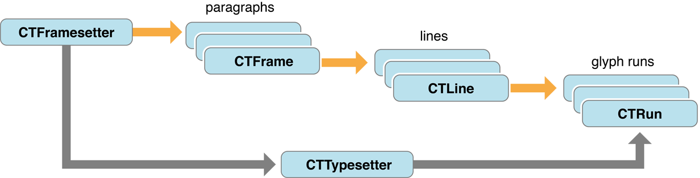

# 关于 Core Text

Core Text 是一种用于布局文本和处理字体的高级、底层技术。在 Mac OS X v10.5 和 iOS 3.2 中引入的 Core Text API 可从所有 OS X 和 iOS 环境访问。

## 大体内容

Core Text 适用于需要与 Core Graphics 框架 (Quartz) 相关的底层文本处理技术的应用程序。如果您直接使用 Quartz 并且需要绘制一些文本，请使用 Core Text。例如，如果你有自己的页面布局引擎——你有一些文本并且你知道它需要在你的视图中去哪里——你可以使用 Core Text 来生成字形并将它们相对于彼此定位，并可以精细地排版，例如字距调整、连字、换行、断字和对齐。

## Core Text 布局文本

Core Text 从字符代码和字体数据生成字形并在放置它们。它将字形分割成行，并将行组合成多行框架（例如段落）。Core Text 还提供字形和布局相关的数据，例如字形位置以及基线和帧的测量数据。它处理字符属性和段落样式，包括各种类型的 tab 样式和位置。

## 使用 Core Text 管理字体

Core Text 字体 API 提供字体、字体集合、字体描述符以及对字体数据的轻松访问。它还支持多种主字体、字体变体、字体级联和字体链接。Core Text 提供了 Quartz 的替代方法，用于将自己的字体加载到当前进程中，即字体激活。
